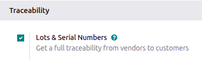
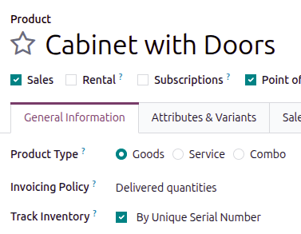
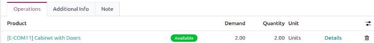
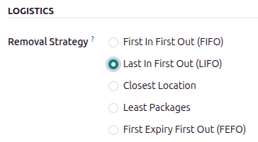
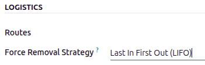
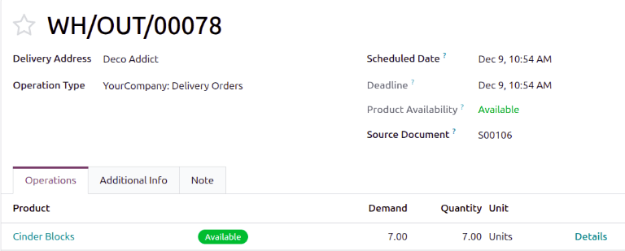
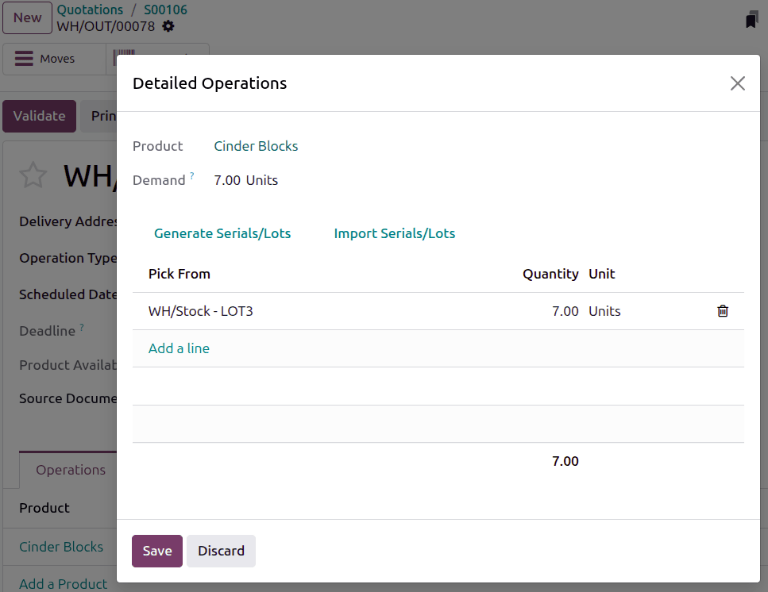

============
LIFO removal
============

The *Last In, First Out* (LIFO) removal strategy picks the **newest** products on-hand, based on the
date they entered a warehouse's stock.

Every time an order is placed for products using the :abbr:`LIFO (Last In, First Out)` strategy, a
transfer is created for the lot/serial number that has most recently entered the stock (the **last**
lot/serial number that entered the warehouse's inventory).

.. warning::
   In many countries, the :abbr:`LIFO (Last In, First Out)` removal strategy is banned, since it can
   potentially result in old, expired, or obsolete products being delivered to customers.

.. _inventory/warehouses_storage/lifo_enable:

Enabling the LIFO removal strategy
==================================

Lots and serial numbers differentiate identical products and track information like arrival or
expiration dates. To enable this feature, navigate to :menuselection:`Inventory --> Configuration
--> Settings`. Under the :guilabel:`Traceability` section, check the box beside :guilabel:`Lots &
Serial Numbers` to enable the feature.

Enable tracking by lots or serial numbers
-----------------------------------------

Next, ensure the intended product is tracked by lots or serial numbers by navigating to the product
form through :menuselection:`Inventory --> Products --> Products` and selecting the desired product.
On the product form, open the :guilabel:`General Information` tab and select the check box next to
the :guilabel:`Track Inventory` field, then select either :guilabel:`By Unique Serial Number` or
:guilabel:`By Lots`.

Assigning lots and serial numbers
---------------------------------

After enabling the features, assign lot or serial numbers to products using an inventory adjustment
or during reception.

By inventory adjustment
~~~~~~~~~~~~~~~~~~~~~~~

Open the :guilabel:`Physical Inventory` page by clicking :menuselection:`Inventory app -->
Operations --> Adjustments --> Physical Inventory`.

To change an existing lot or serial number, click the lot or serial number for the product. On the
:guilabel:`Lot/Serial Number` form, adjust the lot or serial number.

To create a new lot or serial number, on the :guilabel:`Physical Inventory` page, click
:guilabel:`New`. Specify the :guilabel:`Product` and :guilabel:`Lot/Serial Number`. Specify the
:guilabel:`Counted Quantity`. Click :guilabel:`Save`. At this stage, the count (inventory
adjustment) is recorded, but not yet applied. This means that the quantity on hand before the
adjustment has not yet been updated to match the new, real counted quantity. Click the
:guilabel:`Apply` button at the far right side of the page.

.. image:: lifo/assign-lot-inventory-adjustment.png
   :alt: Add a lot or serial number via inventory adjustment.

During receipt
~~~~~~~~~~~~~~

To begin, go to the **Purchase** app to create and confirm a PO for products tracked by lot numbers.
Then, click the :guilabel:`Receipt` smart button that appears at the top of the page to navigate to
the warehouse receipt form. Alternatively, navigate to an existing receipt by going to the
**Inventory** app, clicking the :guilabel:`Receipts` Kanban card, and choosing the desired receipt.

.. important::
   Clicking :guilabel:`Validate` before assigning a lot number triggers an error, indicating that a
   lot number must be assigned before validating the receipt.

   .. image:: lifo/user-error1.png
      :alt: Add lot/serial number user error popup.

On the receipt form, on the product line in the :guilabel:`Operations` tab, select the
:guilabel:`Details` link to the right of the product that is tracked by lot or serial number.

The :guilabel:`Detailed Operations` window opens, where you can assign the :guilabel:`Lot/Serial
Number` and :guilabel:`Quantity`.

To manually assign lot numbers, click :guilabel:`Add a line`. Input the :guilabel:`Lot/Serial
Number`, :guilabel:`Store To` location for the lot, :guilabel:`Quantity`, and
:guilabel:`Destination Package`, if any.

.. note::
   To assign multiple lot numbers, or store to multiple locations, click :guilabel:`Add a line`, and
   type a new :guilabel:`Lot/Serial Number` for additional quantities. Repeat until the total in the
   :guilabel:`Quantity` column matches the :guilabel:`Demand` at the top.

Setting removal strategies
--------------------------

After lot or serial numbers have been assigned, set the removal strategy on the product category or
storage location.

.. image:: lifo/location-categories.png
   :alt: Find the Locations or Categories from the Configuration menu.

On the location
~~~~~~~~~~~~~~~

Open :menuselection:`Inventory app --> Configuration --> Locations`. Select the desired location. On
the location form, under the :guilabel:`Logistics` heading, select :guilabel:`Last In First Out
(LIFO)` from the list of removal strategies.

On the product category
~~~~~~~~~~~~~~~~~~~~~~~

Configure removal strategies on product categories by going to :menuselection:`Inventory app -->
Configuration --> Categories` and selecting the intended product category. Next, in the
:guilabel:`Force Removal Strategy` field, specify :guilabel:`Last In First Out (LIFO)`.

.. important::
   When there are different removal strategies applied on both the location and product category for
   a product, the value set on the :guilabel:`Force Removal Strategy` field set on a product
   category form is applied as top priority.

Workflow
========

Consider the following example, with the product, `Cinder Block`, which is tracked :guilabel:`By
Lots` in the :guilabel:`General Information` tab of the product form. The :guilabel:`Force Removal
Strategy` for the cinder block's product category is set to :guilabel:`Last In, First Out (LIFO)`.

The following table represents the cinder blocks in stock, and their various lot number details.

.. list-table::
   :header-rows: 1
   :stub-columns: 1

   * -
     - LOT1
     - LOT2
     - LOT3
   * - On-hand stock
     - 10
     - 10
     - 10
   * - :ref:`Created on <inventory/warehouses_storage/arrival_date>`
     - June 1
     - June 3
     - June 6

To see the removal strategy in action, create a :ref:`delivery order <inventory/delivery/one-step>`
for seven cinder blocks by navigating to the :menuselection:`Sales app` and creating a new
quotation.

:guilabel:`Confirm` the sales order to create a delivery order. Doing so reserves the newest lot
numbers using the :abbr:`LIFO (Last In, First Out)` removal strategy.

To view the detailed pickings, click the :guilabel:`Details` link, located on the far-right of the
cinder block's product line in the :guilabel:`Operations` tab of the delivery order.

Clicking the :guilabel:`Details` link opens the :guilabel:`Detailed Operations` pop-up window.

In the :guilabel:`Detailed Operations` pop-up window, the :guilabel:`Pick From` field displays where
the quantities to fulfill the :guilabel:`Demand` are picked from. Since the order demanded seven
cinder blocks, the newest cinder blocks from `LOT3` are selected, using the :abbr:`LIFO (Last In,
First Out)` removal strategy.

.. seealso::
   - :doc:`Removal strategies <../removal_strategies>`
   - :ref:`Enable lots tracking <inventory/warehouses_storage/lots-setup>`
   - :ref:`Check arrival date <inventory/warehouses_storage/arrival_date>`
