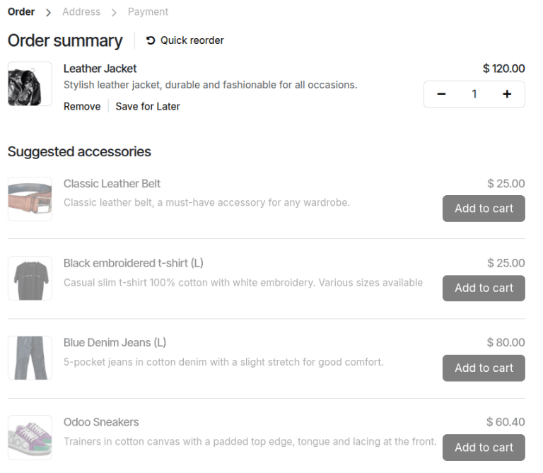
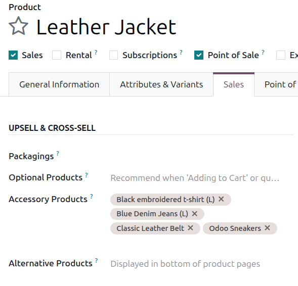
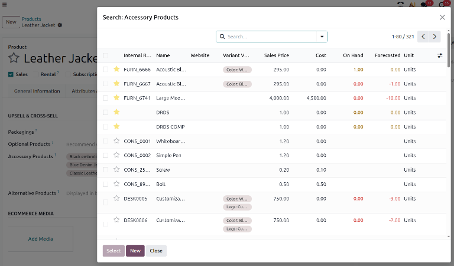

==================
Accessory products
==================

The use of accessory products is a marketing strategy that involves the cross-selling of useful and
related products alongside a desired core product. Accessory products are automatically suggested in
eCommerce interactions when a customer views a shopping cart with an associated core product in it.
For instance, by configuring accessory products, a customer could be suggested a sleeping pad or a
camping pillow when they view their shopping cart with a sleeping bag in it.

.. note::
   Accessory products are differentiated from optional products and alternative products by where
   they appear in the customer's shopping experience.

   - Accessory products appear as suggestions when viewing an eCommerce cart with an associated core
     product in it.
   - Optional products are suggested when a core product has been added to a cart or a quotation.
   - Alternative products are suggested at the bottom of an eCommerce product page whenever the
     product page is viewed.

   Accessory products as they appear in an eCommerce website shopping cart.

Configuring accessory products
==============================

To add an accessory product to a product form, navigate to :menuselection:`Sales --> Products -->
Products` and choose a product. Ensure that the product's :guilabel:`Sales` checkbox is ticked and
click the :guilabel:`Sales` tab. Under :guilabel:`Upsell & Cross-sell` heading, the
:guilabel:`Accessory Products` drop-down menu allows for accessory products to be set. Products will
be displayed in alphabetical order. If the desired product isn't readily visible, type its name in
the field to bring it up, then select it to add it as an accessory product.

To delete an accessory product from the product form, simply click the :icon:`fa-times`
:guilabel:`(Delete)` icon.

Additional products can also be added to a core product by clicking :guilabel:`Search more...`. This
opens the :guilabel:`Search: Optional Products` form, which displays all products in the catalog and
includes the :guilabel:`New` button to create a new product. Multiple products may be selected as
optional products at once when using this form by ticking their checkboxes and then clicking
:guilabel:`Select`.

.. seealso::
   :doc:`../../../websites/ecommerce/products/cross_upselling`
