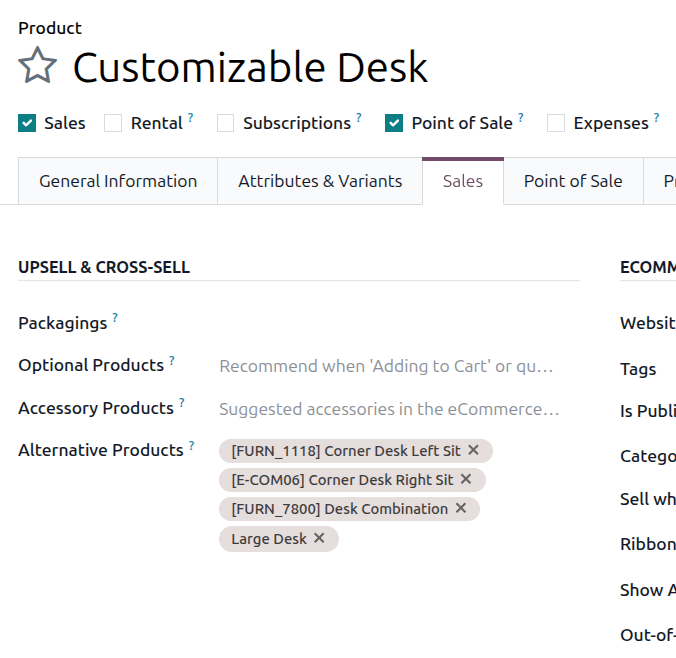
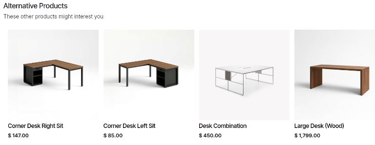
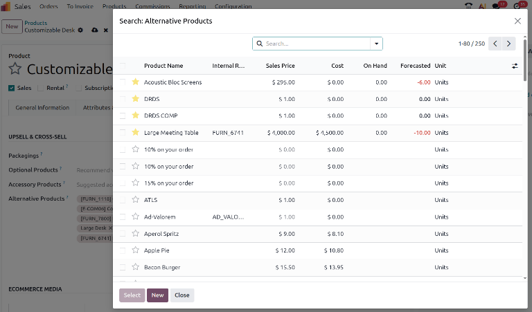

====================
Alternative products
====================

The use of alternative products is a marketing strategy that involves upselling related products
alongside a desired core product. For instance, by configuring alternative products, a customer
could be suggested a mechanical keyboard or a wireless keyboard when they visit the eCommerce
website page for a standard keyboard.

Alternative products are automatically suggested during the shopping process when a customer visits
the webpage for an associated core product.

.. note::
   Alternative products are different from accessory and optional products because of where they
   show up in the customer's shopping experience.

   - Alternative products are suggested at the bottom of an eCommerce product page whenever the
     product page is viewed.
   - Accessory products appear as suggestions when viewing an eCommerce cart.
   - Optional products are suggested when a core product has been added to a cart or a quotation.

   Entries in the :guilabel:`Alternative Products` field on a product form.

   The alternative products section of an eCommerce product page.

Configuring alternative products
================================

To add an alternative product to a product form, navigate to :menuselection:`Sales --> Products -->
Products` and choose a product. Ensure that the product's :guilabel:`Sales` checkbox is ticked and
click the :guilabel:`Sales` tab. In the :guilabel:`Upsell & Cross-sell` section, click the
:guilabel:`Alternative Products` drop-down menu to set alternative products. Products are displayed
in alphabetical order. If the desired product isn't readily visible, type its name in the field to
bring it up, then select it to add it as an alternative product.

To delete an alternative product from the product form, click the :icon:`fa-times`
:guilabel:`(Delete)` icon.

Additional alternative products can also be added to a core product by clicking :guilabel:`Search
more...`. This opens the :guilabel:`Search: Alternative Products` form, which displays all products
in the catalog and includes the :guilabel:`New` button to create a new product. Multiple products
can be selected as alternatives at once in this form by ticking their checkboxes and then clicking
:guilabel:`Select`.

.. seealso::
   :doc:`/applications/websites/ecommerce/products/cross_upselling`
